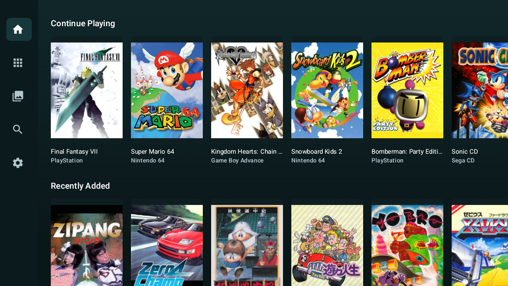

# RomMulus — RomM Client for Android TV

RomMulus is an Android TV (Leanback) companion app for [RomM](https://github.com/rommapp/romm), a
self-hosted game library and ROM manager. It browses your RomM library, downloads and opens
cartridge/disc images, and plays them locally through vendored libretro emulator cores — fully
client-side, no cloud gaming.

> [!NOTE]
> RomMulus supports ARM-based Android TV devices and an x86_64 Linux desktop build for
> Ubuntu 24.04. The portable Linux bundle also targets Steam Deck desktop mode.

## Features

- Browse your RomM library by **platforms**, **collections**, and **search**.
- **Play supported systems natively** on-device via vendored libretro cores (see
  [Supported systems](#supported-systems)), with in-game save sync back to your RomM server.
- **Save & autosave sync**: durable, retryable upload of save states and memory cards via
  WorkManager, plus server-side conflict resolution.
- **Controller configuration**: remap inputs per console, with per-core default profiles and a
  D-pad-first capture flow.
- **BIOS management** for systems that require it (e.g. Sega CD, PlayStation).
- **Phone-assisted QR sign-in** with device-bound tokens on RomM 5.1 and newer, while retaining
  username/password sign-in for older servers.
- 7z/disc archive extraction, cover art and platform icons from your RomM server.
- A minimal permission surface: only `INTERNET` and `ACCESS_NETWORK_STATE`.

## Supported systems

Handled by the vendored cores under [`third_party/cores/`](third_party/cores), each with its own
`VENDORING.md` and license record in
[`CoreManifest.kt`](app/src/main/java/com/romm/androidtv/emulation/model/CoreManifest.kt):

Game Boy / Game Boy Color (Gambatte) · Game Boy Advance (mGBA) · NES/Famicom (FCEUmm) · SNES
(Snes9x) · Master System / Game Gear / Mega Drive / Genesis / Sega CD (Genesis Plus GX) · Atari 2600
(Stella) · Atari 7800 (ProSystem) · Atari Lynx (Handy) · TurboGrafx-16/PC Engine (Beetle PCE Fast) ·
Neo Geo Pocket·Color (Beetle NeoPop) · WonderSwan·Color (Beetle WonderSwan) · Nintendo 64
(Mupen64Plus-next) · PlayStation (PCSX-ReARMed).

## Building

- **Android**: `./gradlew assembleRelease` (NDK r27.2.12479018, CMake 3.22.1; the libretro cores
  build as pinned shared libraries for `armeabi-v7a` and `arm64-v8a`).
- **Tests**: `./gradlew test` (JVM unit tests) and `./gradlew connectedAndroidTest` (instrumented).

A RomM server URL is read from `local.properties` (`romm.origin`) for local debug only; release
builds always use an empty origin and connect via the in-app onboarding flow.

## Releases

Maintainers can run the **Release Android build** workflow from the repository's Actions tab with
a new `X.Y.Z` version. The workflow updates the app version, builds and signs the release APK and
Android App Bundle, commits and tags the version, and publishes them as
`rommulus-X.Y.Z-arm.apk` and `rommulus-X.Y.Z-arm.aab` with release notes generated from commits
since the previous release. Publishing the GitHub release also builds and attaches
`rommulus-X.Y.Z-linux-x86_64.tar.zst` and its checksum. Linux users can extract that
self-contained archive (`tar --zstd -xf <archive>`) and launch `bin/rommulus`. Steam Deck users
should add `bin/rommulus.sh` as a Non-Steam Game. Upload the AAB to Google Play and use the APK
for direct Android installation.

## Permissions

- `android.permission.INTERNET` — communicate with your RomM server and download content.
- `android.permission.ACCESS_NETWORK_STATE` — detect network availability for sync.

No microphone, storage, camera, or location permissions are used or requested.

## Security

- Credentials and the signed-in session are stored via the app's session store (not in plain
  SharedPreferences), and released builds strip the dev origin.
- Network traffic is HTTPS by default; plain HTTP is permitted only for private-network servers,
  with an explicit warning in the onboarding flow.
- **Note on cleartext HTTP**: `app/src/main/res/xml/network_security_config.xml` sets
  `cleartextTrafficPermitted="true"` at the platform layer, because Android's
  `network-security-config` XML cannot express arbitrary private IP ranges (RFC1918, link-local,
  ULA, `.local`). That platform disambiguation is safe only because the real policy is enforced
  in code by `RommServerAddress`: **HTTP to any public/non-local host is rejected outright
  (`INSECURE_PUBLIC_HTTP`)** — only HTTPS, or HTTP to a loopback/private-LAN/.local host, is
  accepted — and HTTPS is never silently downgraded to HTTP. Trust anchors remain system-only.
  This matters to reviewers: the permissive config alone does not allow public plaintext; the
  host-based guard in `RommServerAddress` is the authoritative boundary.
- `android:allowBackup="false"` and an isolated emulation process (`:emulation`) keep session data
  and native playback sandboxed.

See the [RomMulus Privacy Notice](https://dev-duford.github.io/rommulus/privacy/) for details about
data stored on the device and exchanged with a user-selected RomM server.

## Licensing & attribution

This project is licensed under the **GNU General Public License v3.0** (see
[`LICENSE`](LICENSE)). All third-party software is attributed in the app:

- **In Settings → View Licenses**: a merged list of every Gradle dependency (from Google's
  `oss-licenses-plugin`) together with the vendored libretro core notices
  (`app/src/main/assets/licenses/libretro.txt`).
- Per-core license, vendoring, and provenance detail lives in each
  [`third_party/cores/*/VENDORING.md`](third_party/cores) file and the
  [`CoreManifest.kt`](app/src/main/java/com/romm/androidtv/emulation/model/CoreManifest.kt) review
  record.

Several vendored cores carry their own copyleft or non-commercial terms; see the individual
`VENDORING.md` files and `CoreManifest.kt` for the authoritative review.

## Project structure

- `app/` — Android application (Compose + Leanback), including native libretro host.
- `third_party/cores/` — vendored libretro emulator cores (each with `VENDORING.md`).
- `third_party/libretro/` — the canonical `libretro.h` API header.
- `third_party/oboe/` — Oboe C++ audio backend for low-latency emulator audio.

## Disclaimer

RomMulus is an independent open-source client and is not affiliated with or endorsed by the
creators of RomM or any console/emulator trademark holders. Game software is not distributed by
this app; you are responsible for owning the titles you play.